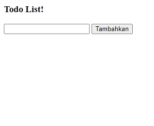
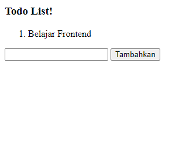
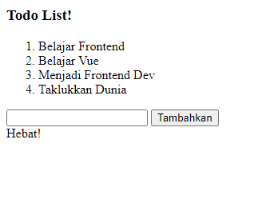

## (11) Vue Fundamental

Vue adalah framework dari Javascript untuk mengembangkan tampilan website yang lebih interaktif dan dinamis.

Alasan penggunaan vue, antara lain:

1. Mudah membuat aplikasi frontend dan website.
2. Mudah dipelajari dan menyenangkan.
3. Vue juga memiliki dokumentasi yang lengkap dan rapi.
4. Ramping dan cepat.

Cara Kerja Vue

1. Vue CDN
   Vue dapat digunakan atau di-import langsung di file HTML dengan menambahkan
   ().
2. Vue CLI
   Vue CLI ini menggunakan perkakas standar dari ekosistem Vue untuk memudahkan setup/pembuatan aplikasi Vue. Vue CLI menyediakan perkakas untuk pengembangan tersebut menjadi lebih mudah.

Dasar-dasar Vue

1. Vue Instance, setiap aplikasi Vue dimulai dengan membuat instance Vue baru dengan fungsi Vue. Instance itu seperti ingatan, apabila instance tidak digunakan lagi, ingatan yang ada di instance itu akan ke reset atau hilang.
2. Vue Data Binding
   Vue.js menggunakan sintaks template berbasis HTML yang memungkinkan kita untuk secara deklaratif mengikat DOM dengan di render ke data instance Vue yang mendasarinya.
   Ada 3 jenis data binding pada Vue:
   - Di dalam konten, untuk menambahkan text ke dalam konten element dapat menggunakan kurung kurawal.
     Message: {{ msg }}
   - Di atribut elemen, untuk menambahkan variabel ke dalam atribut elemen dapat menggunakan v-bind.
   

   - Element HTML, untuk menambahkan HTML elemen ke dalam DOM dapat menggunakan atribut v-html.
   
Text

3. Vue Reactivity
   Vue instance memiliki property bernama data, jika value dari data ada yang berubah maka value yang ditampilkan pada interface akan berubah otomatis tanpa harus dimuat ulang.

## Vue Directive

Vue Directive adalah atribut khusus yang diawali dengan v-. Directive berfungsi untuk menjalankan satu perintah atau ekspresi javascript di dalam atribut.
Macam Vue Directive

1. v-bind
   Direktif untuk memberitahu Vue kalau kita ingin melakukan one way data binding.
2. v-model
   Direktif untuk memberitahu Vue kalau kita ingin melakukan two way data binding.
3. v-if, v-else, dan v-else-if
   Direktif yang digunakan untuk melakukan rendering secara kondisional.
4. v-on
   Direktif untuk memberitahu Vue kalau kita ingin memanggil fungsi.
5. v-for
   Direktif untuk memberitahu Vue kalau kita ingin melakukan pengulangan.

Shorthand Vue Directive
Khusus untuk v-bind dan v-on dapat disingkat dengahn sintaks seperti berikut

Vue Directive yang perlu diingat:

1. Direktif Data Binding : v-bind, v-model, v-html, v-text.
2. Direktif Conditional Rendering : v-if, v-else, v-else-if.
3. Direktif Perulangan : v-for.
4. Direktif Event : v-on.

## Events dan Method

1. Memantau Events
   Kita dapat menggunakan direktif v-on untuk mendengarkan peristiwa DOM dan menjalankan ebeberapa JavaScript saat di picu.
2. Menggunakan Methods
   Methods adalah fungsi, yang dapat diakses secara langsung pada instance VM, atau menggunakannya dalam ekspresi direktif. Semua metode akan memiliki konteks "this" secara otomatis terikat ke instance Vue.

## Computed Properties dan Watchers

1. Computed Properties
   Memberikan terlalu banyak logika secara langsung di template dapat menyebabkan menjadi berat dan susah untuk dipelihara. Pada poin ini, template tidak lagi sederhana dan deklaratif. Masalahnya diperburuk ketika kita ingin memasukan pesan terbalik itu ke dalam template lebih dari sekali. Itulah mengapa untuk logika yang kompleks kita harus menggunakan computed properties.
2. Watchers
   Watcher di Vue.js adalah fitur khusus yang memungkinkan kita untuk memantau sebuah variabel dan melakukan tindakan tertentu ketika nilai tersebut berubah.

## Component

Komponen adalah Vue instance yang dapat digunakan kembali dengan nama yang kita definisikan. Kita bisa menggunakan komponen ini sebagai kustom elemen di dalam instance root Vue yang dibuat dengan new Vue.

## Task

Membuat Todo List dengan kondisi dan visual seperti pada contoh yang diberikan.
File source code Todo List yang telah dikerjakan : [todo-list](pratikum/todo-list.html)

1. Hasil screenshot sebelum melakukan input data, terdapat sebuah kolom input dan sebuah tombol :
   

2. Hasil screenshot setelah melakukan input data, dan reset kolom input setelah tombol diklik :
   

3. Hasil screenshot apabila list yang sudah dimasukkan sama dengan atau lebih besar dari 4 maka tunjukkan kata 'Hebat!' dibawah input.
   
