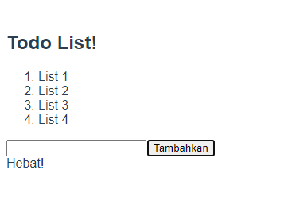

# (12) Vue CLI

# Resume Materi

## Vue CLI

Vue CLI adalah perkakas standar untuk memudahkan penyetelan/pembuatan aplikasi Vue baru.
Webpack adalah sebuah module bundler, digunakan untuk menggabungkan seluruh modul project aplikasi berupa file Javascript, HTML, CSS, gambar dan lain-lain menjadi satu file (tipe yang sama).
Cara kerja Vue CLI :

1. Instalasi atau Pasang Vue CLI

   - Untuk memasang Vue CLI pada perangkat kita jalankan perintah: npm install -g @vue/cli
   - Untuk memastikan Vue CLI sudah terpasang dengan baik, jalankan vue --version

2. Inisiasi Aplikasi

   - Untuk membuat sebuah aplikasi baru, jalankan vue create <nama aplikasi> pilih default Vue 2.

3. Jalankan Aplikasi

   - Untuk menjalankan aplikasi, terdapat beberapa perintah yang tertulis di script di dalam package.json (npm run serve)
   - Setelah selesai melakukan proses kompilasi dan tidak ada error, akan ada log informasi alamat aplikasi kita dapat diakses (localhost).
   - Jika di dalam direktori aplikasi kita tidak terdapat node_modules atau isinya tidak mutakhir, perlu melakukan perintah : npm install
   - Baru bisa melakukan proses kompilasi tanpa error, dengan melakukan run kembali (npm run serve).

## Extentions

Sebelum kita masuk ke Vue Single File Component, ada beberapa extentions yang sangat penting untuk membantu proses pengembangan pada VSCode

1. Linter (ESLint)
   Linter, untuk memindai kode Anda secara terprogram dengan tujuan menemukan masalah yang dapat menyebabkan bug atau ketidakkonsistenan dengan standar yang berlaku.
2. Highlighter (Vetur)
   Highlighter sintaks, untuk memberikan warna pada kodingan kita sesuai dengan setelan/peraturan dari ekstensi berkas yang digunakan.
3. Code Formatter (Prettier)
   Code Formatter, untuk membantu menyeragamkan gaya kode yang kita tulis. Dapat mengubah secara otomatis gaya kode yang kita tulis sesuai dengan pengaturan yang berlaku ketika kita menyimpan file.
4. Git Inspector (GitLens)
   Git inspector, untuk dapat mengetahui versi atau commit yang ada untuk setiap baris kode, dan sangat membantu ketika berkolaborasi dnegan rekan tim.

## Komponen File Tunggal

Komponen file tunggal memungkinkan kita membangun seluruh komponen (struktur, gaya, dan fungsi) dalam satu file. Dan, sebagian besar editor kode menyediakan penyorotan sintaks dan linting. Komponen file tunggal memiliki ekstensi .vue
Cara kerja Komponen File Tunggal, terdapat 3 tag utama pada Komponen File Tunggal, yaitu <template>, <script>, dan <style>.

1. Template, sama seperti HTML body, memuat, dan me-render HTML tag pada umumnya.
2. Script, memuat sintaks Javascript. Juga dapat menerima atribut lang yang biasanya untuk penggunaan Typescript.
3. Style, memuat sintaks CSS. Juda dapat menerima atribut lang yang biasanya untuk penggunaan CSS preprosessor seperti Stylus, SCSS. Atribut tambahan lainnya adalah scoped, yang berarti CSS hanya akan diterapkan di komponen ini saja.

## Task

Membuat Todo List dengan kondisi dan visual seperti pada contoh yang diberikan.
File source code Todo List yang telah dikerjakan : [todo-list](pratikum/task-vue-cli/src/App.vue)

