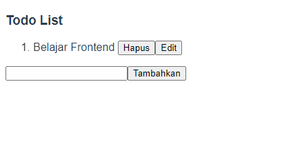
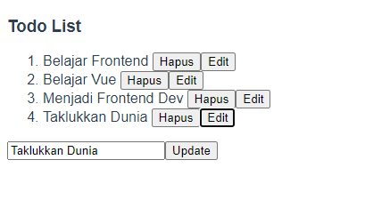
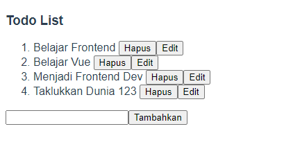
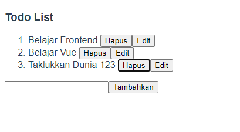

# (13) Komponen Vue

# Resume Materi

## Komponen Vue

## Module Export & Import

### Javascript Module

Modul bisa berisi kelas atau pustaka fungsi untuk tujuan tertentu. Modul dapat dikatakan seperti container atau wadah, isi yang ada pada modul itu tidak bergantung dan harusnya tidak boleh bergantung dengan isi yang ada di modul yang lainnya. Modul hanya sebuah file atau satu kode skrip.

### Perbedaan Module dan Regular Script

Modul bisa memuat satu sama lain dan menggunakan pengarah khusus export dan import untuk fungsi pertukaran, memanggil fungsi dari satu modul ke modul lainnya.

1. CJS (Common Javascript), atau biasa yang tidak menggunakan modul. Import semua isi syntax require.
2. ESM (ES Modules), import yang hanya dibutuhkan saja, dan lebih flexible menyesuaikan kebutuhan.

### Export

Digunakan untuk menyediakan fungsi, objek, atau nilai primitif dari modul sehingga dapat digunakan oleh modul lain dengan pernyataan import. Export itu yang menyediakan apa saja yang bisa di import oleh modul lain.
Ada 2 Tipe Export

- Name Exports (Ekspor nol atau lebih per modul), export const
- Default Exports (satu per modul), export default

### Import

Import digunakan untuk mengambil atau menerima variabel, obyek, atau fungsi yang disediakan oleh modul lain.
Ada 4 Tipe Import, antara lain:

- Importing defaults (import target)
- Import multiple exports (import {target})
- Rename multiple exports (import {taget as t})
- Import defaults + multiple (import targetDefault, {target as t})

## Komponen Vue yang dapat digunakan kembali

### Apa itu komponen Vue yang dapat digunakan kembali?

Sebuah Komponen File Tugas Vue yang bertujuan untuk dapat digunakan lebih dari satu kali di tempat yang berbeda.
Keuntungannya:

- Lebih rapi
- Lebih udah dirawat
- Lebih berkualitas

### Direktori Komponen

Pada umumnya komponen dijadikan satu dengan komponen lain dan dipisah dengan komponen yang bertugas sebagai halaman.

- Halaman dapat menggunakan komponen namun komponen tidak dapat menggunakan halaman.
- Komponen dapat menggunakan komponen lain.
  Didalam direktori components tidak menutup kemungkinan untuk dibuat sub-direktori.

### Komunikasi Anak Komponen dan Induk Komponen

Untuk mengekspos data dari induk ke anak dapat dilakukan dengan:
"<HelloWorld msg="Welcome to Your Vue.js App" @click="showAlert"/>"
(msg="Welcome to Your Vue.js App" -> Props -> Variabel)
(@click="showAlert" -> Emits -> Fungsi/Event)

## Paradigma Fungsi Pembantu

Sebuah Fungsi perkakas/pembantu yang bertujuan untuk dapat digunakan lebih dari satu kali ditempat yang berbeda.

- Lebih Efektif
- Lebih Efisien
- Menghindari Huru-hara

### Direktori Komponen

Pada umumnya fungsi pembantu dijadikan satu pada direktori yang sejajar dengan komponen atau halaman.

### Tips

Fungsi pembantu bisa diberi nama yang berbeda-beda namun harus mudah dimengerti, jamak dan self-descripting, seperti:

- Utilities
- Utils
- Helpers
- Tools

Beberapa contoh fungsi pembantu yang sering dipakai:

- Operator (penambahan, rata-rata, median, min-max, hitung umur, dll.)
- Formatter (tanggal, waktu, mata uang, dll.)
- Validator (email, nomor telepon, nomor kartu kredit, dll.)
- Generator (angka random, text random, warna, format text, dll.)

## Instance Lifecycle Hooks

Lifecycle, Setiap Vue Instance melewati beberapa serangkaian tahapan pada saat dibuat, tahapan ini disebut sebagai Lifecycle atau siklus hidup.

### Bagaimana Cara Kerja Lifecycle di Vue

Siklus hidup sebuah Vue Instance berawal ketika inisiasi dan berakhir ketika penghancuran.
Setiap siklus memiliki hook-nya masing-masing yang berbentuk fungsi.
beforeCreate, created, beforeMount, mounted, beforeUpdate, updated, activated, deactivated, beforeDestroy, destroyed, errorCaptured

### 3 Lifecycle Utama

Di antara banyaknya lifecycle hook, tidak perlu memahami dengan penuh apapun yang terjadi. Cukup memahami 3 lifecycle utama yang memiliki fungsi masing-masing, sebagai berikut:

1. Created, berlangsung setelah instance terbentuk dan sebelum DOM dirender.
   Contoh penggunaan:
   - Menambahkan SEO Meta
   - Memasang event listener scroll
2. Mounted, berlangsung setelah DOM dirender.
   Contoh penggunaan: Handling loader.
3. Destroyed, berlangsung sebelum instance dihancurkan.
   Contoh penggunaan: Mencopot event listener scroll.

## Task

Buatlah sebuah todo list dengan menggunakan komponen file tunggal.
Dengan kondisi dan contoh visual, sebagai berikut:

1. Input todo yang lebarnya memenuhi layar.

   

2. Masing-masing item memiliki tombol Hapus dan Edit dengan fungsionalitasnya.

   - Tampilan ketika tombol Edit ditekan, simpan perubahan setelah tombol Edit ditekan kembali.

   

   

   - Jika tombol Hapus ditekan, maka list dibawahnya akan naik ke atas menggantikan.

     

note: Tampilan tidak harus sama persis namun usahakan rapi. Fungsionalitas Edit dan Hapus harus ada.
hint: Gunakan array map dan array filter.
