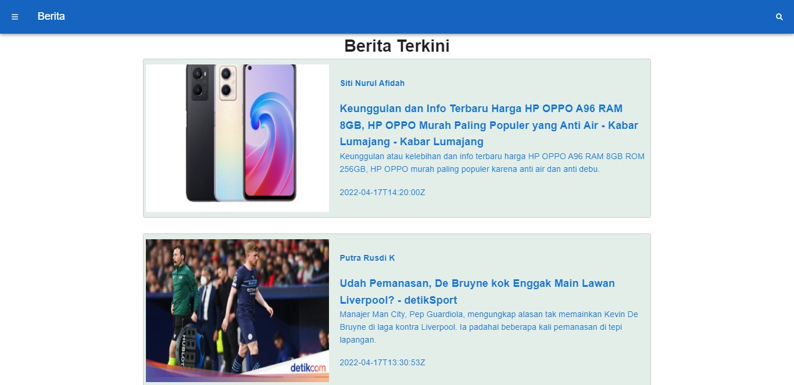

# (17) Vue UI Framework

# Resume Materi

## Pengenalan Kerangka UI Framework

### UI Framework

UI Framework adalah kumpulan elemen visual (seperti tombol, ikon, dan lain-lain) dan fungsionalitas yang bisa dipakai secara instan. UI Framework membantu kita untuk membuat aplikasi web dengan tampilan yang baik dan terlihat profesional.
Cara Kerja Rangka Kerja UI:
Rangka kerja menyediakan komponen siap pakai kemudian kita impor komponen yang kita butuhkan ke dalam aplikasi. (Vuetify, BootstrapVue, Buefy, Ant-design Vue, Vuesax, dll.)

### Vuetify

Library yang memungkinkan kita membuat aplikasi dengan tampilan yang indah walaupun kita bukanlah seorang desainer. Vuetify memiliki lebih dari 80 komponen berbasis Material Design yang mana komponen tersebut dapat membantu kita lebih cepat dalam pengembangan aplikasi.
Cara Kerja Vuetify:
Vuetify telah menyiapkan komponen siap pakai yang bisa kita gunakan di aplikasi kita. Sebagai contoh, komponen tombol.
Dokumentasi Komponen Vuetify dapat diakses melalui halaman resmi Vuetify https://vuetifyjs.com/en/
Dokumentasi Penggunaan, untuk mengetahui daftar lengkap props yang tersedia di masing-masing komponen dapat melalui tautan yang terdapat di bagian API halaman Komponen.
Menerapkan Vuetify:

1. Pasang Vuetify sebagai dependency
2. Daftarkan Vuetify ke dalam berkas entry main.js
3. Ubah App.vue, Vuetify harus dibungkus dengan v-app untuk dapat berfungsi dengan baik
4. Tambahkan font ke dalam public/index.html
5. Komponen Vuetify siap digunakan dimana saja tanpa perlu impor

### Manajemen Warna Tema

Manajemen Warna Tema adalah pengaturan set warna yang dapat kita terapkan terhadap tampilan di aplikasi.
Cara Kerja Manajemen Warna Tema:
Vuetify menyimpan warna tema bawaan yang bisa kita setel secara manual ketika palikasi berjalan. Komponen Vuetify menggunakan warna primary sebagai warna dominannya.
Buat fungsi untuk mengganti tema warna Vuetify kemudian tambahkan menu pilihan warna.

### Gelap Terang

Tema Gelap Terang adalah fitur peralihan warna latar belakang aplikasi dari terang ke gelap atau sebaliknya. Cara kerjanya yaitu Vuetify memiliki variabel boolean dark dan juga menyimpan warna tema bawaan mode gelap (this.$vuetify.theme.dark).

### Reaktivitas Dengan Kerangka Kerja UI

Reaktivitas Viewport adalah perubahan ukuran yang menyesuaikan dengan lebar layar tampilan.
Cara Kerja Reaktivitas pada Vuetify: Lebar layar dibagi menjadi beberapa golongan dan setiap komponen dapat ditentukan ukurannya berdasarkan golongan tersebut. (code: xs, sm, md, lg,xl)

### Extra

1. Tabel, mempunyai fitur tambahan untuk pagination, filter dan sort.
2. Validasi Input, komponen input memiliki props untuk validasi yang cukup canggih, menerima array of functions.
3. Skeleton Loader, membuat loading seperti aplikasi pada umumnya.
4. Dialog, membuat pop-up dialog tidak lagi menjadi mimpi buruk berkat bantuan rangka kerja UI.

## Task

Refaktor aplikasi Berita pada Task Vue Data menggunakan Vuetify.

