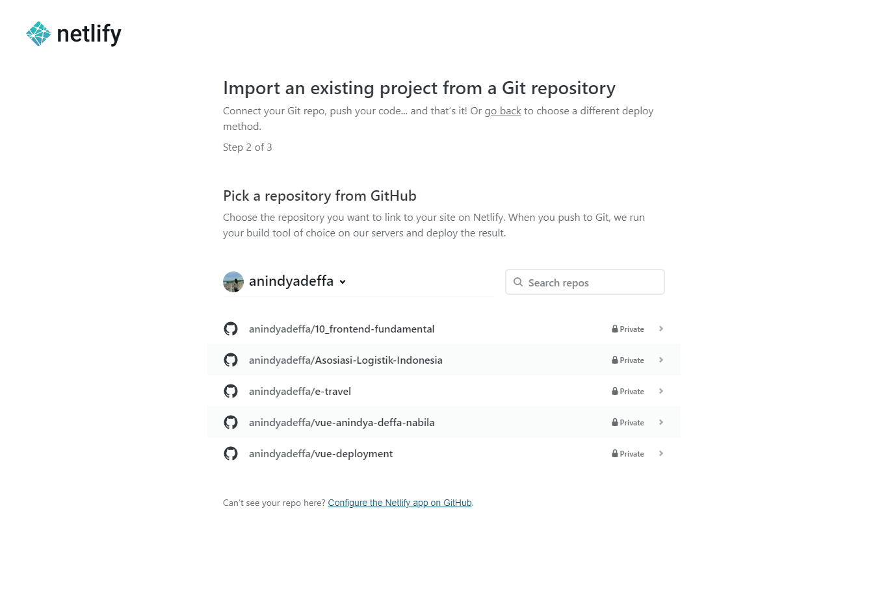
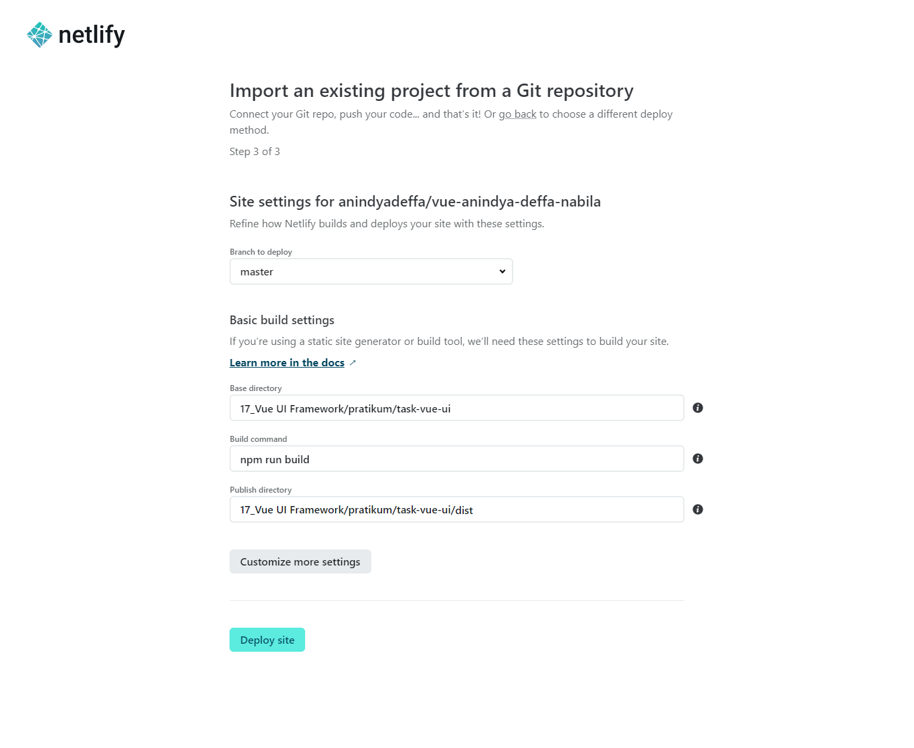
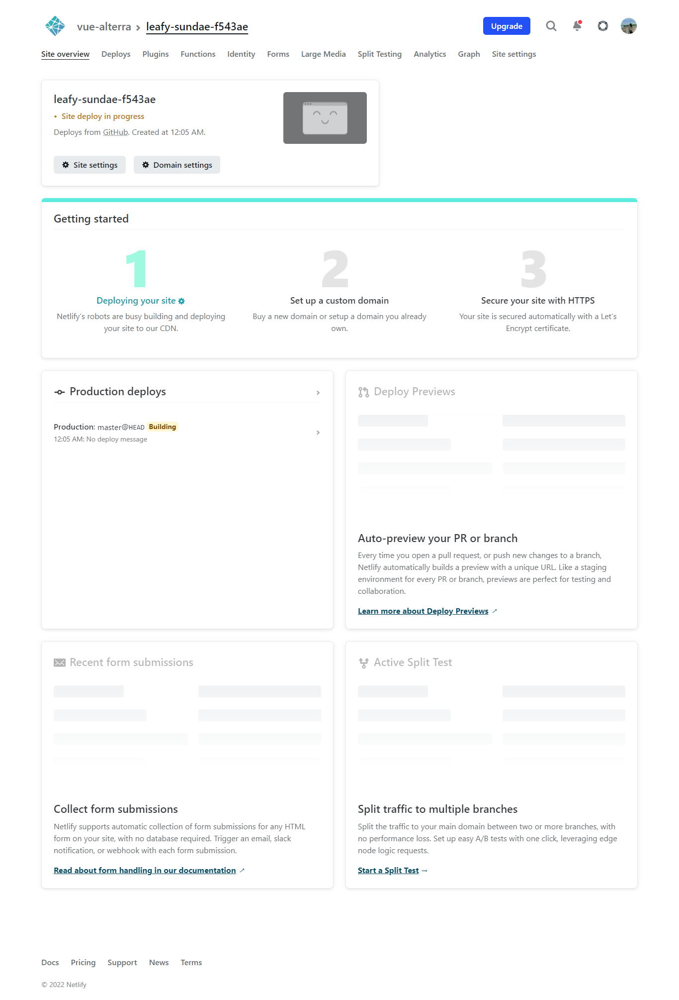

# (18) Work Together With Product – Backend and Devops

# Resume Materi

### Tim Produk

Tim pengembangan produk adalah sekelompok orang yang mengawasi proses desai produk baru. Setiap anggota tim berkolaborasi dengan yang lain untuk membuat dan menerapkan strategi.

##### Product Management (PM)

Manajemen produk melibatkan penciptaan visi, pengembangan strategi, dan penerapan rencana untuk produk/fitur baru.

##### User Experience (UX)

Profesional UX memantau bagaimana penggunaan berinteraksi dengan produk dengan membuat draf produk, melakukan penelitian, dan menguji kegunaan.

##### User Interface (UI)

Membangun antarmuka dengan fokus pada gaya dan interaktivitas. Tujuan perancangan UI adalah untuk membuat antarmuka yang menurut pengguna mudah digunakan dan menyenangkan secara estetika.
Tools yang digunakan, antara lain Figma, Zeplin, Adobe XD.

### Tim Backend

Pengembangan Back-end mengacu pada pengembangan sisi server. Ini berfokus pada database, scripting dan arsitektur situs web.
Kode yang ditulis oleh pengembang back-end membantu browser untuk berkomunikasi dengan informasi database. Artefak Tim Backend adalah API Endpoint dan Dokumentasi API. Tools yang dapat digunakan adalah Swaggerhub dan Postman.

### Tim DevOps

Tim yang bertujuan untuk mempersingkat siklus hidup pengembangan sistem dan menyediakan pengiriman berkelanjutan dengan kualitas perangkat lunak yang tinggi. Secara singkat, tim Devops membantu proses deployment.
Tools yang digunakan:

1. Tanpa perkakas
   Langsung menghubungkan kode dengan server host.
2. Docker
   Perkakas untuk mengisolasi dan menyeragamkan versi dependensi sebagai sebuah kontainer.
3. Travis CI / Github Actions
   Perkakas integrasi kontinyu yang secara otomatis menjalankan serangkaian I tes/prosedur sebelum deployment.

### Melakukan Deployment

1. SSG (Static-Side Generating) dapat menggunakan NETLIFY
2. SSR (Server-Side Rendering) dapat menggunakan HEROKU

## Task

Melakukan deployment menggunakan Netlify atau Heroku.

Link yang didapatkan dari Netlify Deployment : https://625c48f3d3dd48012cc00990--leafy-sundae-f543ae.netlify.app/

