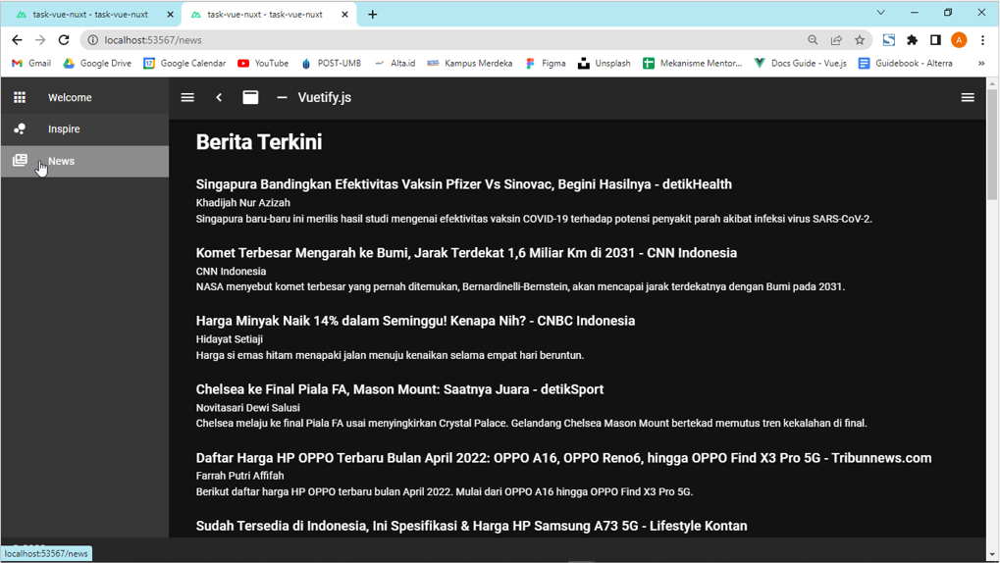
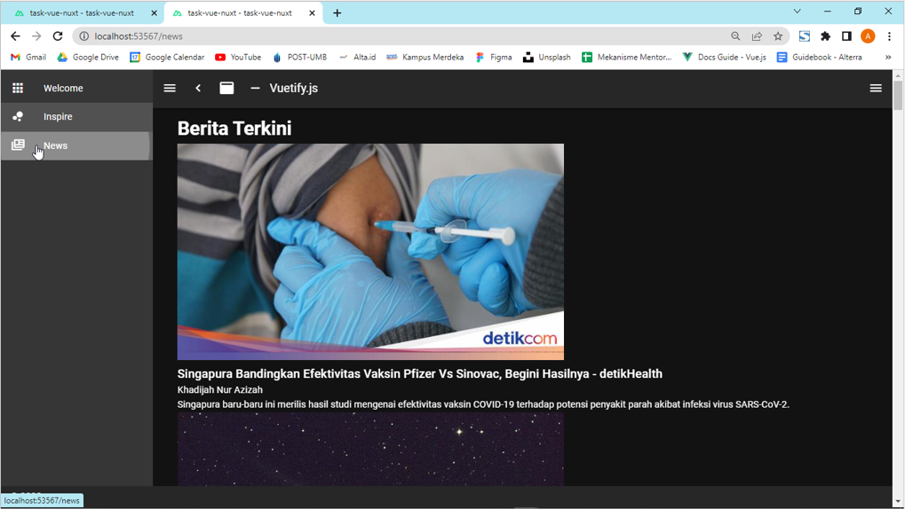

# (19) Vue With Nuxt

# Resume Materi

## Nuxt

Nuxt adalah kerangka kerja yang dibangun diatas Vue yang membuat pengembangan web menjadi sederhana dan ampuh.

1. Inisiasi Aplikasi
   Untuk membuat sebuah aplikasi baru, jalankan: npx create-nuxt-app <nama proyek>
2. Jalankan Aplikasi
   Untuk menjalankan aplikasi, terdapat beberapa perintah yang tertulis di script di dalam package.json

### Struktur Direktori Nuxt

1. Pages
   Router di Nuxt secara otomatis membaca direktori ini sehingga file yang ada di direktori /pages langsung terhubung menjadi path halaman.
2. Layouts
   Setiap file di direktori /layouts akan membuat tata letak khusus yang dapat diakses dengan properti layout di komponen halaman.
3. Static
   Semua file yang disertakan akan secara otomatis diekspose oleh Nuxt dan dapat diakses melalui URL root proyek

### Nuxt SSG & SSR

1. SSG (Static Site Generation)
   SSG (Static Site Generation), metode pengembangan ini lebih cocok untuk situs web yang tidak memiliki halaman dinamis.
   Cara Kerja SSG, ketika sebuah proyek dibangun untuk produksi, file HTML siap pakai akan dibuat di folder dist, kemudian disuguhkan oleh server dan dapat diakses per masing-masing file HTML
2. SSR (Server Side Rendering)
   SSR (Server Side Rendering), metode pengembangan ini adalah solusi terbaik untuk proyek di mana halaman dibuat secara real time, yaitu melalui panel admin, misalnya halaman blog dan e-commerce.
   Cara Kerja SSR, Server yang dibangun dalam Nuxt akan berjalan dalam produksi yang akan memastikan bahwa file HTML baru dihasilkan secara real time ketika data baru diterima, misalnya melalui API.

### SEO (Search Engine Optimization)

SEO (Search Engine Optimization), yaitu proses meningkatkan kualitas dan kuantitas lalu lintas situs web ke situs web atau halaman web dari mesin pencari. Sedangkan, SEO Meta tag adalah tag tak terlihat di dalam <head> yang memberikan data tentang halaman ke mesin pencari dan pengunjung situs web.
Cara Kerja SEO Meta, SEO Meta Tag dapat diterapkan dari Nuxt config untuk pengaturan global, yaitu konten head akan sama di setiap halaman aplikasi.
SEO Meta Tag Penting:

- Informasi dasar: title dan description
- Identitas unik dengan link canocial
- Informasi untuk media sosial, ope graph: og:title, og:description, og:image

SEO di dalam Body Tag:

- Judul: h1
- Text alternatif untuk gambar: alt

SEO Lainnya:

- Peta indexing: sitemap
- Pengarah crawler: robots.txt

### PWA (Progressive Web Apps)

PWA (Progressive Web Apps), dibuat dan disempurnakan dengan API modern untuk menghadirkan peningkatan kemampuan, keandalan, dan kemudahan pemasangan sekaligus menjangkau siapa saja, dimana saja, di perangkat apa pun dengan Basis Kode Tunggal.

## Task

Refaktor aplikasi Berita pada Vue UI Framework menggunakan Nuxt

