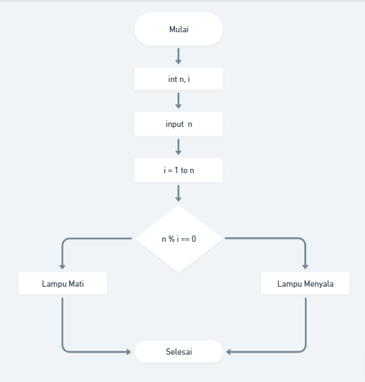

# (20) Introduction Algorithm

# Resume Materi

## Pengenalan Algoritma

Algoritma adalah prosedur komputasi yang didefinisikan dengan baik yang mengambil beberapa nilai sebagai input dan menghasilkan beberapa nilai sebagai output. Contoh: Check Prime Number, Sorting, Searching.
Karakteristik Algoritma, antara lain:

1. Memiliki batas (Awal dan Akhir)
2. Instruksi terdefinisi dengan baik
3. Efektif dan Efesien

Algoritma Dasar, terdapat Sequential, Branching, dan Looping.

1. Sequential adalah urutan dalam menyusun langkah-langkah untuk menyelesaikan sebuah masalah. Proses dibutuhkan berurutan dan tersusun dengan tepat.
2. Branching, digunakan untuk menentukan sebuah alur dari program. Ketika menemukan kondisi tertentu, maka proses selanjutnya yang akan dieksekusi itu seperti apa, kita dapat menentukan skenario yang lainnya.
3. Looping adalah konsep untuk melakukan sebuah aksi secara berulang, sampai kondisi tertentu.

## Pseudo Code

Pseudo Code adalah deskripsi bahasa sederhana yang bisa digunakan untuk menuangkan sebuah ide algoritma itu sendiri.

## Flowchart

Flowchart adalah suatu bagan dengan simbol tertentu yang menggambarkan urutan dan hubungan antar proses secara mendetail.

## Task

Membuat Flowchart
Problem 1 - Bilangan Prima
Problem 2 - Lampu dan Tombol

Link Whimsical :
https://whimsical.com/flowchart-vue-alterra-DrJ3QbXToqyMdQiwNC5qvG

