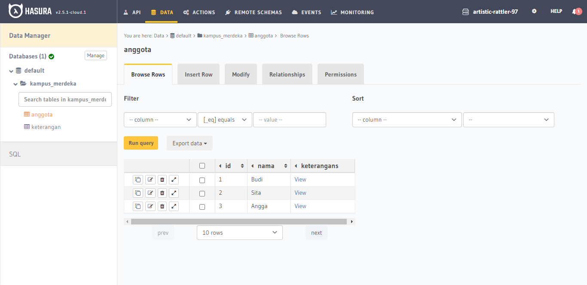
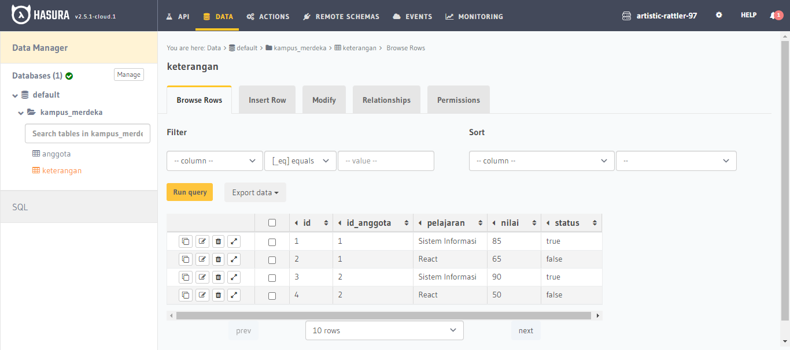
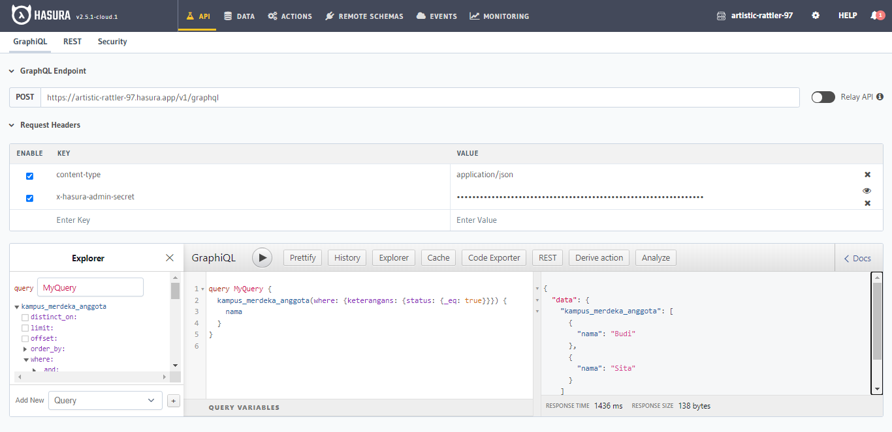
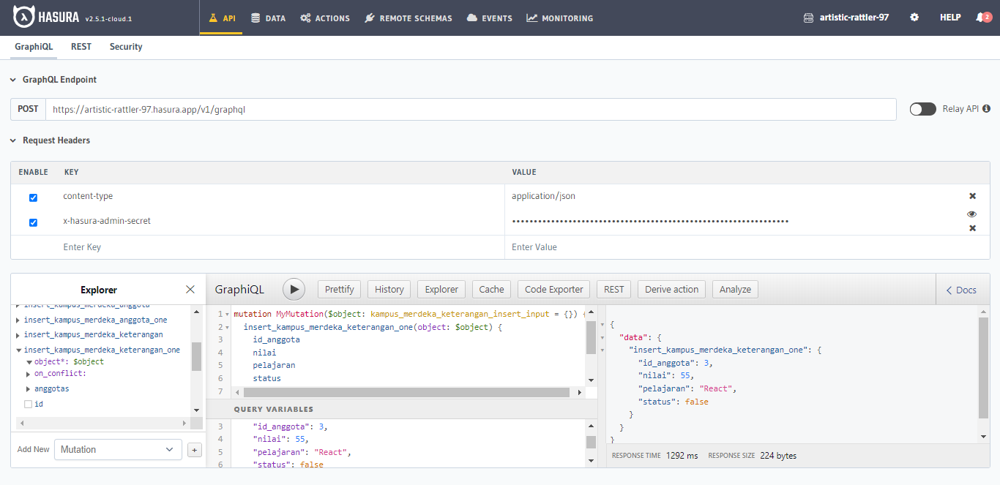
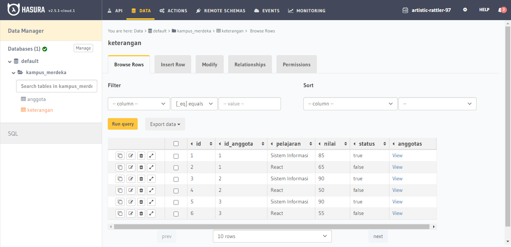
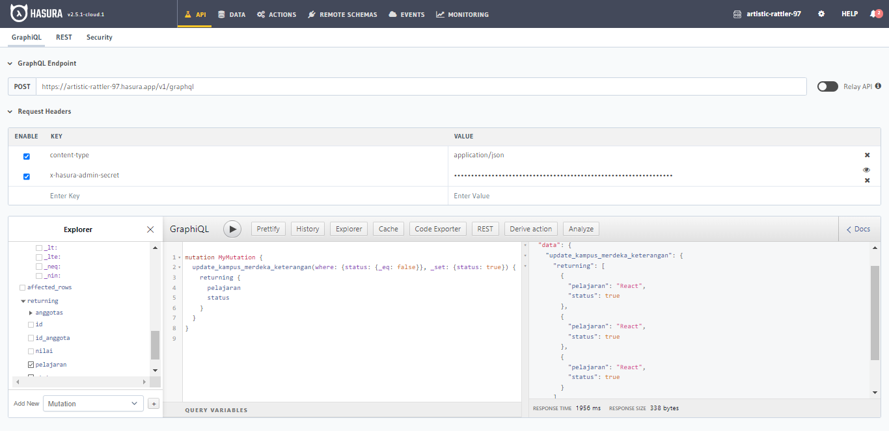
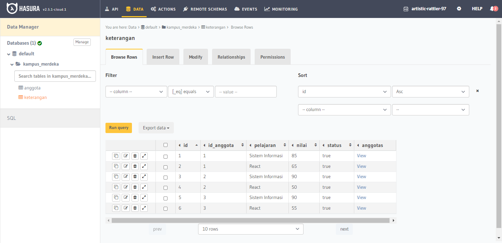

# (21) Understancing GraphQL Basic

# Resume Materi

## GraphQL

GraphQL adalah bahasa queri untuk API, dimana kita bisa men-define skema data yang ingin kita kirim ke client, dan kita bisa me-minimize jumlah datan atau field yang kita inginkan. Dengan GraphQL kita bisa menggunakan satu endpoint saja, dengan satu endpoint kita bisa menggunakan semua request yang kita butuhkan, termasuk get, edit, insert, dan delete data.

Terdapat 3 fitur utama dari GraphQL, yaitu:

1. Query, cara kita untuk mendapatkan data atau get data.
2. Mutation, manipulasi data (insert, update, delete data).
3. Subscription, bisa mendapatkan data paling updated dan realtime.

## Task

