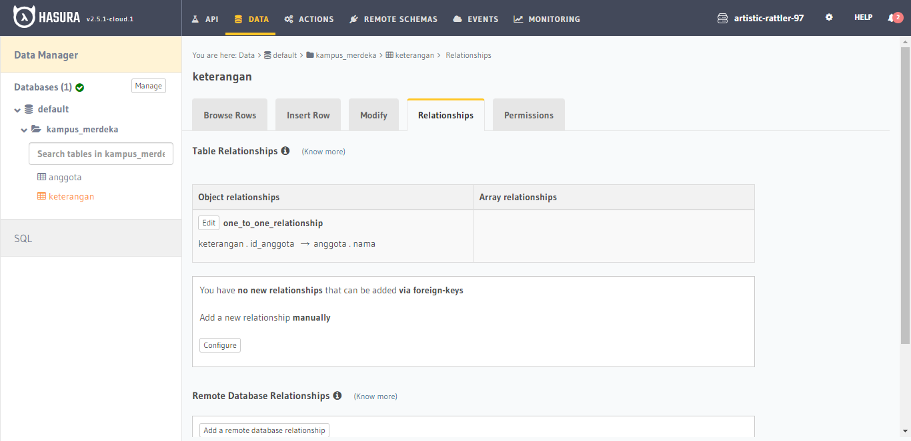

# (22) Relational Database

# Resume Materi

## Database Relationship

\*sebagai contoh kasus yaitu Twitter

1. One to One Relationship, 1 user hanya memiliki 1 foto profil
2. One to Many Relationship, 1 user bisa memiliki banyak tweets
3. Many to Many Relationship, 1 user bisa memiliki banyak follower user, 1 user bisa di follow banyak user

Contoh lain untuk Many to Many Relationship, yaitu 1 mahasiswa bisa memiliki banyak mata kuliah, 1 mata kuliah bisa diambil oleh banyak mahasiswa.

## How to Implement

Relational Database Management Systems (RDBMS) adalah software yang menggunakan Relational Database Model sebagai dasarnya, contoh MySQL.

Tipe Data MySQL, yaitu Num, Huruf, Date

## Jenis Perintah SQL

1. Data Definition Language (DDL)
2. Data Manipulation Language (DML)
   Data Manipulation Language (DML) adalah perintah yang digunakan untuk memanipulasi data dalam tabel dari suatu database. Statement Operation, yaitu Insert, Select, Update dan Delete. DML Statement, yaiut Like/Between, And/Or, Order By, Limit, dan Join.

- Join adalah sebuah klausa mengkombinasi record dari dua atau lebih tabel. Join standar SQL ANSI (Inner Join, Left Join, Right Join).
- Fungsi Agregasi, adalah fungsi dimana nilai beberapa baris dikelompokkan bersama untuk membentuk nilai ringkasan tunggal. (Min, Max, Sum, Avg, Count, Having).
- Subquery atau Inner Query atau Nested Query adalah query di dalam query SQL lain. Subquery digunakan untuk mengembalikan data yang akan digunakan dalam query utama sebagai query utama sebagai syarat untuk lebih membatasi data yang akan diambil.

3. Data Control Language (DCL)

## Task

