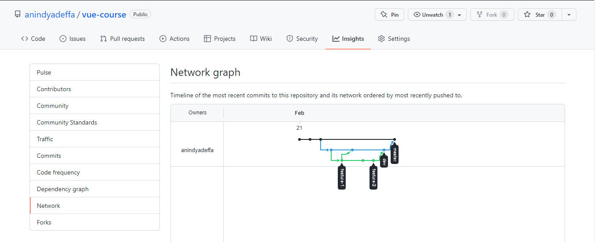

# (2) Verison Control and Branch Management (Git)

## Resume Materi

### Pengertian dari Verison Control / Git

Versioning berfungsi untuk mengatur versi dari source code program. Version control membedakan file dengan versi yang terbarunya.
GIT merupakan salah satu version control system popular yang digunakan para developer untuk mengembangkan software secara bersama-sama.
Git yang terdistribusi bukan tersentralisasi, artinya masing-masing computer dapat mendistribusikan ke dalam remote server dan memiliki masing-masing backup – an di remote computer / server tersebut.

### Materi yang dibahas

##### Git Repository (Folder Project)

Folders and Files yang telah di distribukan ke Folder Project akan memberitahukan keseluruhan History yang telah dilakukan.
Git track every file changes. Commit = the record of changes, yang artinya seluruh commit akan tercatat di Git, di setiap bagian pada file yang mengalami perubahan nantinya.
Belajar secara pratikal, yang dilakukan sebagai berikut:

- Git Install
- Check Git version
- Make a new repository
- Using Git Bash
- Git Cloning

##### The Staging Area

Perubahan dari Working Directory dengan melakukan ‘git add’ untuk memasuukan perubahan tersebut ke staging area. Dari Staging Directory akan masuk ke Repository dengan melakukan ‘git commit’.
Belajar secara pratikal, yang dilakukan sebagai berikut:

- Git add
- Git commit -m 'commit message'
- Git push, git push dilakukan ketika file telah di commit, yang berarti telah di wrap ke dalam satu paket yang akan siap dikirim menggunakan perintah ‘git push’ tersebut.
- Commit Message, penulisan commit message harus dijelaskan secara deskripsi, jelas dan terperinci.

##### Git Diff And Stash

Git diff berfungsi untuk mengetahui bagaimana perubahan yang terjadi di file yang telah di ubah.
Git Stash berfungsi untuk menyimpan perubahan itu, sehingga nanti dapat dikembalikan di perubahan – perubahan yang diinginkan.

##### Inspecting Repository (Bagaimana untuk dapat me-management versi yang telah dibuat)

1. Git Log and Git Checkout
   Git Log, berfungsi untuk dapat menampilkan setiap commit yang telah dilakukan, sedangkan Git Checkout untuk dapat kembali ke commit – an sebelumnya.

2. Git Reset
   Git reset terbagi menjadi dua jenis, antara lain:

- Git reset – soft : uncommit change, changes are left staged.
- Git reset – hard : uncommit + unstage + delete changes, nothing left.
  Perbedaannya:
- Untuk soft, perubahannya terjadi tidak sebanyak yang dilakukan hard, dan juga commit – an nya tetap masih ada.
- Sedangkan, untuk hard, nanti bisa menghapuskan commit di versi yang kita pilih atau input.
- Soft lebih di recommended, karena hard akan menghilangkan secara permanent.

##### SYNCING

1. Git Remote, Git Fecth, Git Push, and Git Pull
   Git remote memberikan versi dari remote-an kita sewaktu clone, yang nantinya akan muncul sebuah link dari github repository yang sudah kita akses atau telah dibuat.
   Belajar secara pratikal, yang dilakukan sebagai berikut:

- Git remote
- Git fetch
- Git push, git push dilakukan ketika file telah di commit, yang berarti telah di wrap ke dalam satu paket yang akan siap dikirim menggunakan perintah ‘git push’ tersebut.
- Git pull

##### BRANCHES

Melakukan penyabangan untuk mempermudah kolaborasi dengan banyak cabang.
Belajar secara pratikal, yang dilakukan sebagai berikut:

- List branch : git branch --list
- Create a new branch : git branch feature-1
- Delete branch : git branch -D feature-1
- List remote branch
- Git push origin branch

##### PULL REQUEST

Teknik ini digunakan untuk kita dapat bisa berkontribusi terhadap repository yang sudah ada, baik repository teman ataupun perusahaan.

## Task

Buatlah repository baru di Github, dengan membuat branch baru sebagai developer, dan membuat branch ketiga dan ke empat sebagai penambahan fitur, kemudian melakukan merge ke branch developer. Buktikan dengan screenshot insights network-nya.

Berikut link source code dari pratikum ini:
[index.html](pratikum/index.html)

Dan berikut hasil screenshot insights network-nya:

