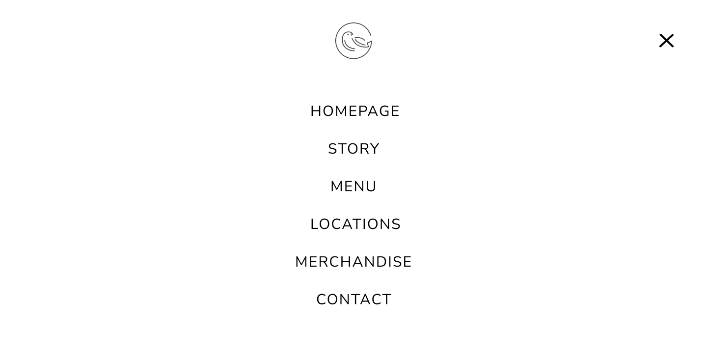
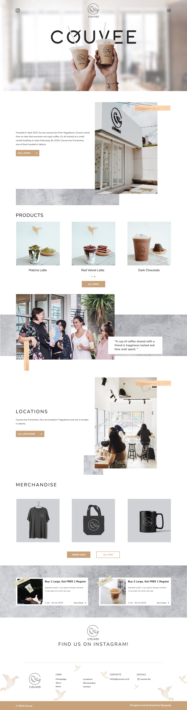
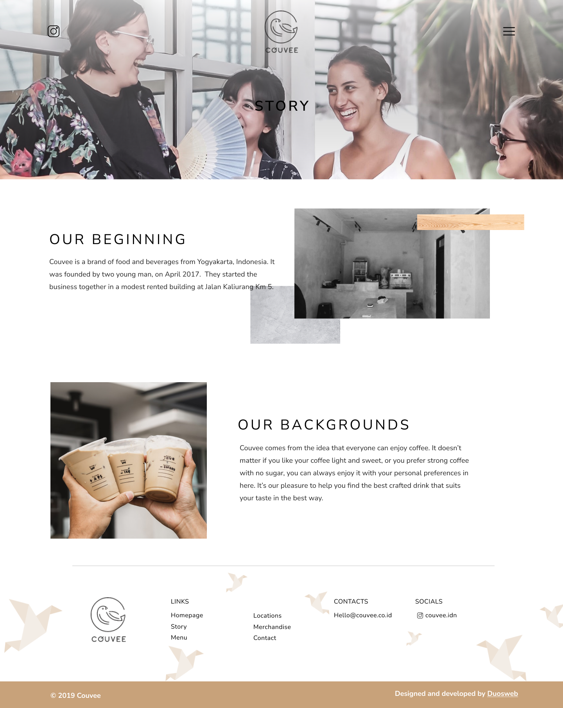
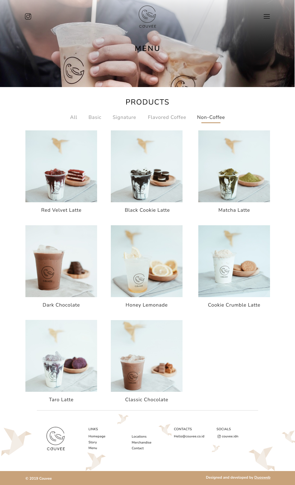
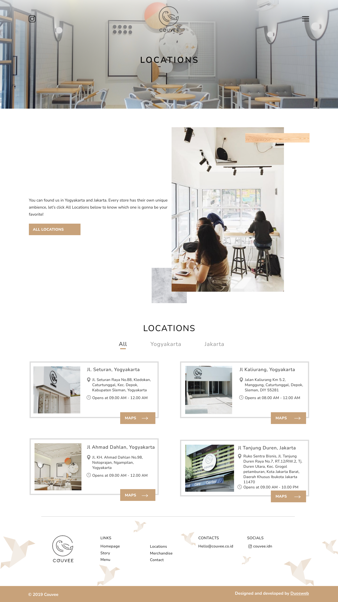
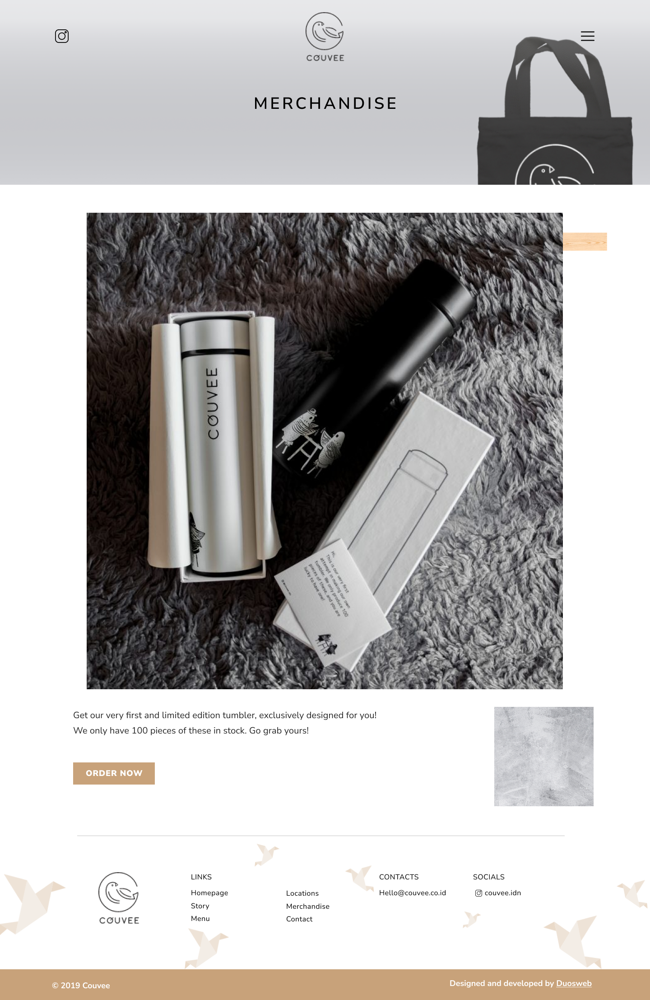
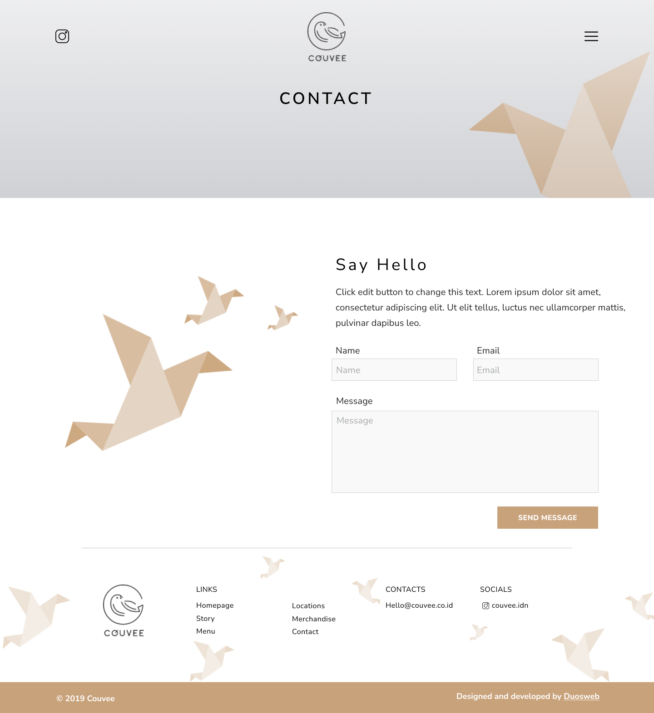

# (4) Figma

# Resume Materi

## Figma

Figma adalah suatu alat editor vector grapik dan prototyping dimana berbasis website, dengan tambahan fitur-fitur yang online dan tersedia di aplikasi desktop untuk macOS dan juga Windows.

Keuntungan dari Figma, antara lain:

- Gratis untuk lebih dari dua user dan tiga projek dalam satu akun.
- Dapat berjalan di Mac maupun PC (sketch only on Mac).
- Kolaborasi tim secara real-time.
- Dapat import sketch files (tapi, tidak bisa di ekspor ke sketch!)
- terintergrasi oleh Developers
- Team Library atau sistem desain yang bagus.
- Terintegrasi prototyping yang berkualitas tinggi.

Kekurangan dari Figma adalah pengerjaannya hanya dilakukan secara online, dimana bisa di simpan dan membuatnya secara lokal, namun butuh untuk menambahkannya nanti secara online.

## IDE / Tools

1. Importing old Sketch files
2. Setting up new frames (atau artboards)
3. Grid and layout columns
4. Layers and groups
5. Images
6. Typography

##### Bagaimana cara untuk set up sebuah frame dan grid yang simple ?

1. Step 1, membuat file baru dan pilih Frame tool di toolbar. Fokus ke sidebar di kanan dan pilih Desktop template untuk memulai membuat frame.
2. Step 2, Sebelum memulai, set up simple grid terlebih dahulu akan memudahkan untuk meluruskan element. Fokus pada Design panel di kanan sidebar dan klik Layout Grid section, kemudian tambahkan grid ke dalam design.

##### Bagaimana untuk membuat Menu Bar ke dalam Website Design ?

1. Step 1, pilih Rectangle tool (R) di toolbar dan buatlah bentuk 1360 x 90 px. Fokus ke sidebar kanan, dan set Corner Radiusnya menjadi 10, kemudian klik Fill color dan diubah menjadi warna hex yang diinginkan.
2. Step 2, Ambil Text Tool (T) dari toolbar dan klik frame, dan fokus ke Text section dari panel Design. Set font style dan juga ubah warna sesuai yang diinginkan.
3. Step 3, drag and copy.
4. Step 4, set Spacing between elements di Auto Layout.
5. Step 5, Ellipse Tool (O).
6. Step 6, Text tool di toolbar, untuk menambahkan text judul.
7. Step 7, set font style to bold.
8. Step 8, create component.

## Task

Mencari desain ui ux, dan menidentifikasi bagian-bagian yang ada pada website tersebut. Jelaskan detail fitur dan letar dari UI dan UX yang ditemukan.

Berikut link file document dari pratikum ini:

[pratikum-figma.txt](pratikum/pratikum-figma.txt)

Dan berikut hasil export gambar dari design yang telah dibuat :

