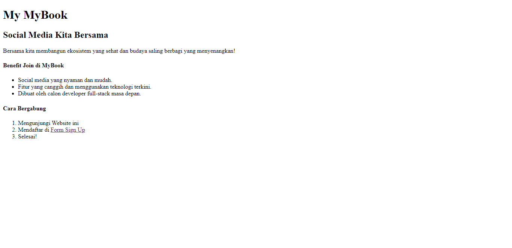
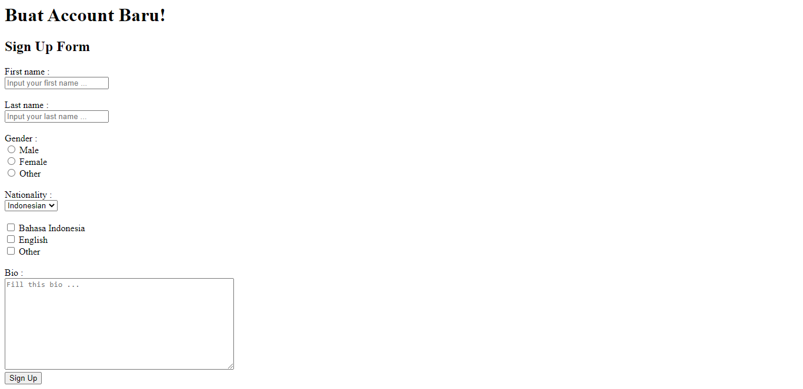
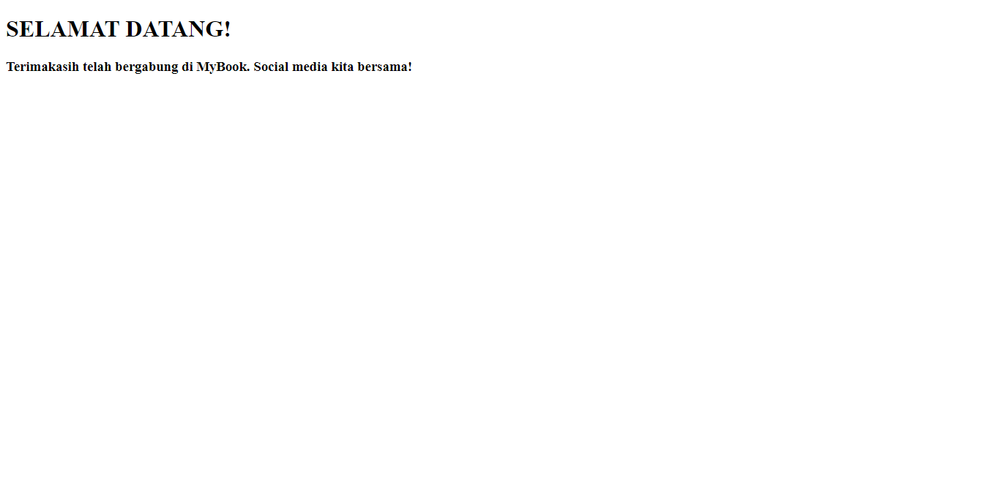

# (5) HTML

# Resume Materi

## Frontend

Frontend adalah sebuah bagian dari website yang membuat tampilan yang menarik kepada user.

## HTML (Hypertext Markup Language)

HTML (Hypertext Markup Language) adalah sebuah standar yang digunakan secara luas untuk menampilkan halaman web.
Kegunaan HTML, antara lain :

- Membuat struktur dari halaman website.
- Mengatur tampilan dan isi dari halaman web.
- Membuat tabel dengan tag HTML table.
- Membuat form HTML.
- Membuat gambar dengan canvas.
- Mempublikasikan halaman website secara online.

### HTML Editors

HTML Editors yang dapat digunakan antara lain Notepad, Visual Studio Code, Notepad++, dan Atom Editor.

### Dokumentasi HTML

1. <! DOCTYPE html> untuk mendefinisikan dokumen ini sebagai HTML5
2. tag html elemen root dari halaman HTML
3. tag head berisi informasi meta tentang dokumen
4. tag title untuk menentukan judul untuk dokumen
5. tag body berisi konten halaman yang terlihat

### Tag HTML

1. Tag Div, yang didalamnya berisikan content HTML
2. Tag Heading & Paragraph HTML, tag heading h1 sampai h6 dan tag p untuk paragraf
3. Styling pada paragraf HTML
   - tag strong untuk membuat text lebih tebal
   - tag em untuk menjadi italic.
   - tag s untuk membuat text dengan garis tercoret.
   - tag br atau tag line break untuk membuat garis baru.
4. Tag Link HTML atau anchor, link dengan membuka tab baru menggunakan target="\_blank"
5. Tag image HTML
6. List HTML (li)
   - Ordered List (ol) untuk list yang berurut. Untuk type terdapat type a, A, i, dan I.
   - Unordered List (ul) untuk list yang tidak terurut. Untuk type-nya terdapat square, disc, dan circle.
7. Tag Table HTML
   - tag table untuk membuat tabel.
   - tag tr untuk baris tabel atau table row.
   - tag td untuk kolom tabel atau table data.
   - tag th untuk table head.

## Task

Membuat 3 halaman website sederhana, yang membuat file index.html yang memuat text, deskripsi, list, dan link yang berpindah halaman ke form Sign Up dengan nama file form.html berisikan form group. Dan juga file welcome.html yang berisikan text judul dan deskripsi.

Berikut link file source code dari pratikum ini:

- Untuk halaman index : [index](pratikum/index.html)
- Untuk halaman form : [form](pratikum/form.html)
- Untuk halaman welcome : [welcome](pratikum/welcome.html)

Dan berikut hasil screenshots dari halaman yang telah dibuat:

