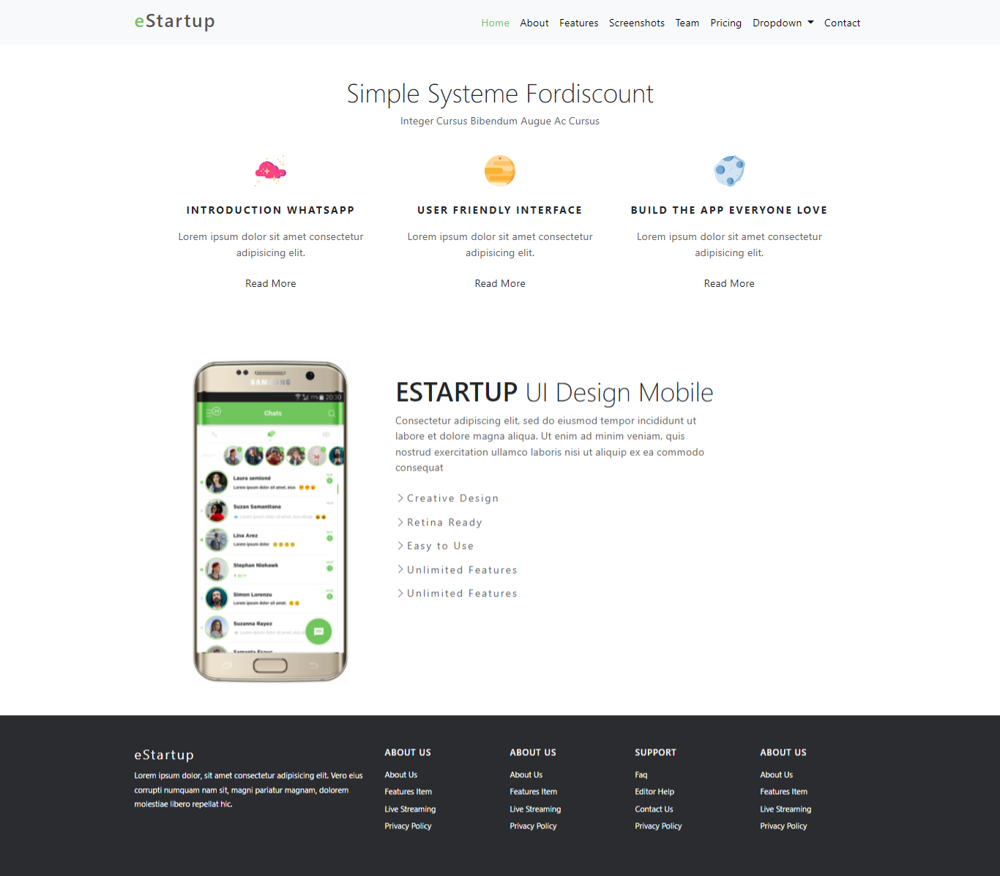
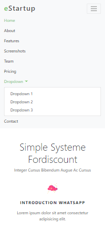
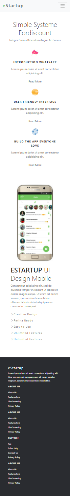

# (7) Bootstrap

# Resume Materi

## Bootstrap

Frontend Framework adalah sekumpulan aturan kode yang bisa kita gunakan untuk mempermudah dalam membuat suatu tampilan website.
Bootstrap membantu memudahkan dalam pembangunan sebuah website menjadi lebih mudah.
Tugas Frontend adalah untuk mewujudkan tampilan UI dan UX yang sudah dibuat oleh UI/UX Designer.

Alasan pemilihan Bootstrap, antara lain:

1. Gratis,
2. Mudah dipelajari,
3. Cepat, dan
4. Responsif.

Pembelajaran secara pratikal dengan melakukan exercise, antara lain:

##### Welcome Page

1. Navbar
   - Brand e Navbar
   - Responsive
   - Dropdown
   - Menu Navbar
2. Main Welcome
   - Text Welcome
   - Main Page
   - Links
   - Background

##### Contact Page

1. Navbar (Fixed)
2. Contact Page
   - Form
   - Detail Icon and Text
   - Footer

## Task

Membuat halaman Landing Page menggunakan framework Bootstrap. Dengan header, body, dan footer sesuai dengan ketentuan dan assets yang telah diberikan.
Berikut link file source code dari pratikum ini:

- Untuk halaman Landing Page Website : [landing-page](pratikum/task-bootstrap.html)

Dan berikut hasil screenshot dari halaman Landing Page yang telah dibuat :

