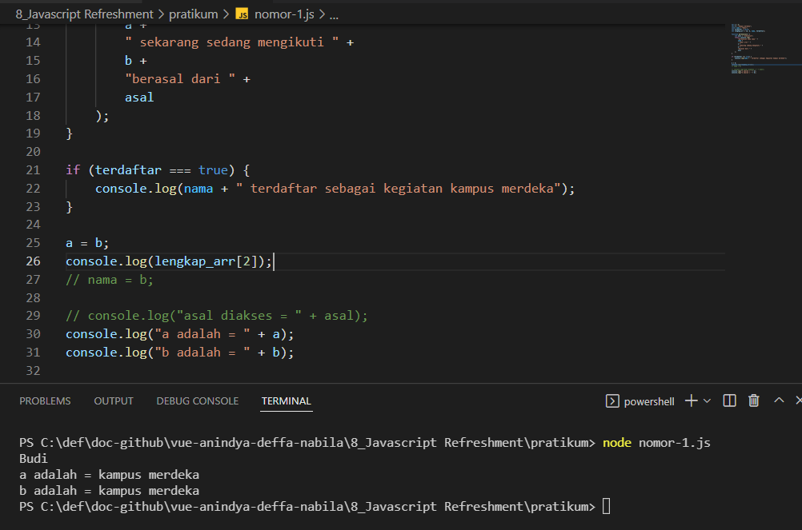
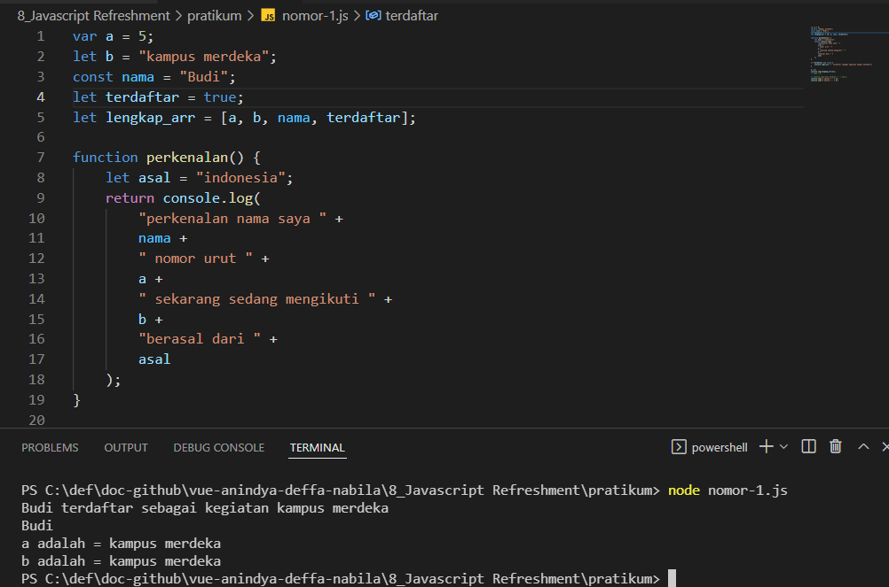
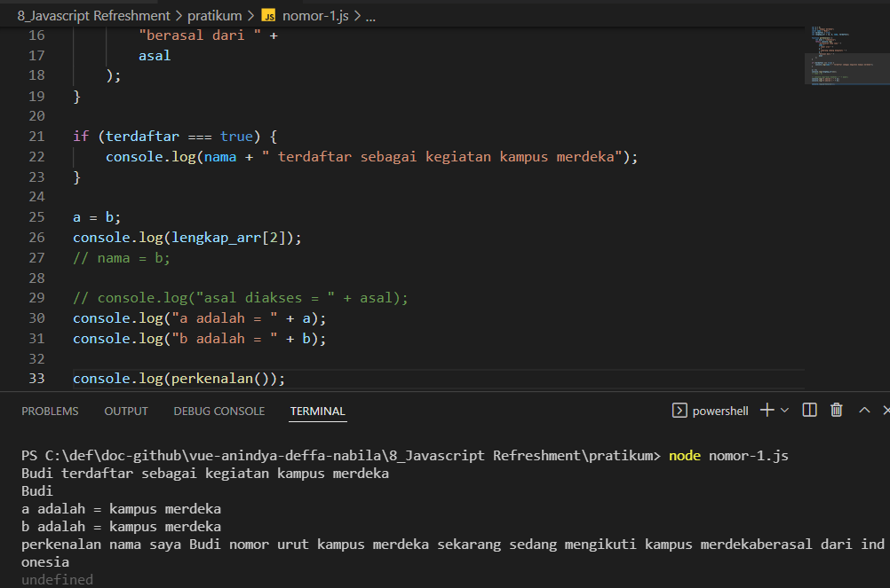
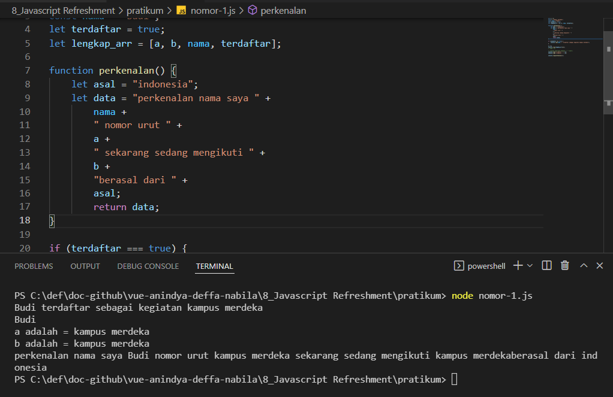
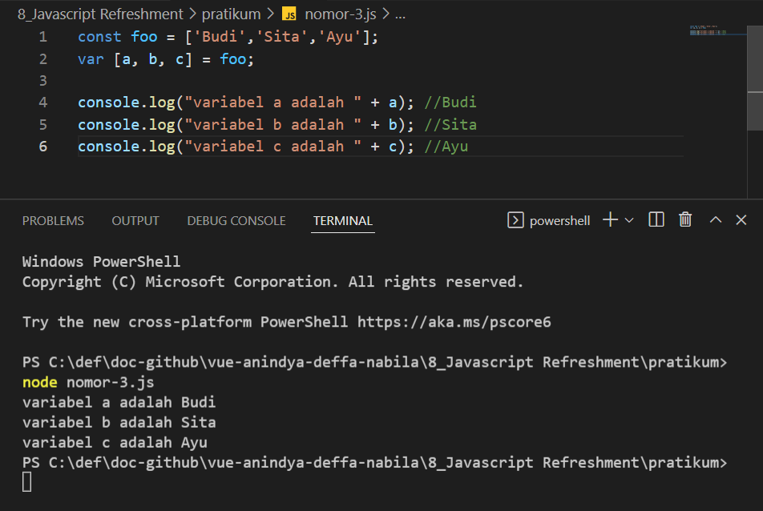
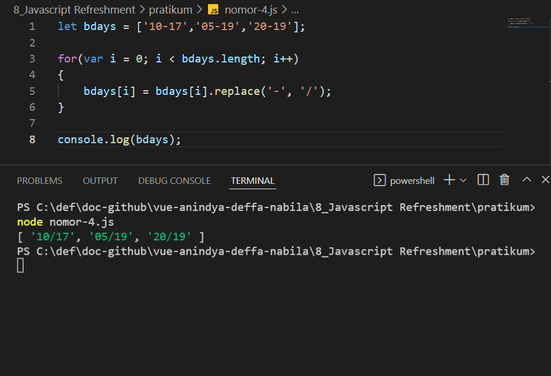
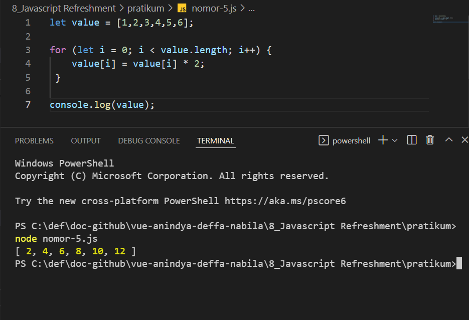
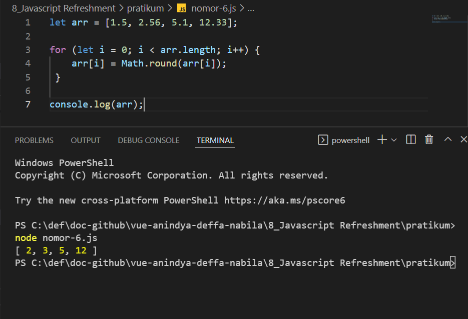

# (8) Javascript Refreshment

# Resume Materi

## Pendahuluan

Javascript adalah bahasa pemrograman yang High-level, Scripting, Untyped dan interpreted.

##### Kenapa dengan Javascript?

Javascript adalah bahasa pemrogaman tingkat tinggi, yang dibuat untuk berinteraksi dengan halaman web, apapun itu web browsernya.
Javascript merupakan bahasa yang untyped atau bahasa yang tidak terpengaruh dengan tipe data.
Javacript adalah bahasa yang fleksibel, mudah untuk di uji, dan javascript sendiri memiliki beberapa framework library yaitu Bootstrap, Vue, React, dll.
Javascript adalah bahasa pemrograman yang mudah di pelajari, namun sulit untuk dikuasai, karena banyaknya library yang ada di javascript.

Machine -- Bahasa C -- C++ -- Python -- JavaScript -- Manusia
note : bahasa pemrograman yang semakin mendekati manusia, semakin mudah di mengerti oleh manusia, dan Javascript berada paling dekat atau merupakan bahasa paling tinggi.

## Values

### Declaration

Declaration adalah proses pembuatan variabel untuk menyimpan data. Declaration memiliki 3 cara untuk deklarasi, antara lain:

- Var, pada umumnya jarang digunakan.
- Let, digunakan saat kita membutuhkan nilai yang dapat diubah.
- Const, digunakan saat kita membutuhkan nilai yang tidak bisa di "reassign", dimana tidak dapat memberikan nilai baru saat variabel const tersebut sudah memiliki nilai sebelumnya. Saat kita mendeklarasikan variabel const, kita harus memberikan nilai pada variabel tersebut.

1. Redeclaration adalah mendeklarasikan kembali variabel dengan nama yang sama. Untuk Var disini bisa dilakukan deklarasi ulang, sedangkan Let dan Const tidak dapat dilakukan deklarasi ulang.
2. Reassignment adalah memberikan nilai baru ke dalam variabel yang sudah ada nilai sebelumnya. untuk Var dan Let dapat melakukan reassignment, sedangkan Const tidak.

### Scoping

Scoping adalah untuk menentukan dimana variabel, fungsi, dan objek diatur dan dapat diakses dalam kode kita. Ini berarti ruang lingkup variabel dikendalikan oleh lokasi deklarasi variabel.

1. Global Scope
2. Function Scope
3. Block Scope

## Task

### Question :

1. Melakukan penulisan ulang kode seperti pada contoh gambar, dan simpan dengan format javascript.
   a. Ambilah index ke 2 dalam array di baris 5 dan tampilkan dalam console.
   b. Ubah kode diatas sehingga dapat menampilkan baris 22 di dalam console.
   c. Lakukan pemanggilan untuk function perkenalan pada baris 31.
   d. Bebas untuk mengubah kode diatas sehingga menampilkan output pada console seperti pada contoh gambar.

2. Jawab pertanyaan dibawah sesuai dengan materi yang telah dijelaskan!
   a. Jelaskan kenapa baris 21, 22, 23 tidak dapat tampil?
   b. Jelaskan kenapa deklarasi pada baris 26 menyebabkan error?
   c. Dengan melakukan komen pada baris ke 26, apakah baris 28 dapat di eksekusi? Jelaskan.

3. Lakukan desctucturing pada kode di bawah sehingga Budi Tersimpan dalam variable bernama a, Sita tersimpan dalam variabel bernama b, dan Ayu terseimpan dalam variable bernama c.
4. Kalian memiliki sebuah variable berikut (let bdays = ['10-17','05-19','20-19']). Ubahlah tanda (-) dalam variabel tersebut menjadi (/) sehingga output yang akan keluar dalam console menjadi ['10/17','05/19','20/19']
5. Kalian memiliki variabel berikut (let value = [1,2,3,4,5,6]). Kalikan setiap value dalam array tersebut dengan dua. Sehingga, ketika dipanggil variable value mengeluarkan output berupa [ 2, 4, 6, 8, 10, 12 ]
6. Kalian memiliki variabel berikut (let arr = [1.5, 2.56,5.1,12.33]). Bulatkan ke atas variable tersebut sehingga output yang dihasilkan adalah [2, 3, 5, 12].

### Answer :

1. Untuk file source-code : [nomor-1](pratikum/nomor-1.js)
   a. Melakukan penambahan function untuk pendeklarasian variable 'lengkap_arr' dengan code "console.log(lengkap_arr[2]);".
   Hasil screenshot untuk nomor 1 a : 
   b. Melakukan pengubahan kondisi yang terdapat pada baris 4, yaitu mengubah dari false menjadi true.
   Hasil screenshot untuk nomor 1 b : 
   c. Melakukan pemanggilan untuk function perkenalan.
   Hasil screenshot untuk nomor 1 c : 
   d. Membuat variabel baru yaitu variabel data.
   Hasil screenshot untuk nomor 1 d : 

2. Jawab pertanyaan dibawah sesuai dengan materi yang telah dijelaskan!
   a. Jelaskan kenapa baris 21, 22, 23 tidak dapat tampil? Karena nilai awal atau
   kondisi sebelumnya adalah 'false', oleh karena itu baris 21, 22, 23 tidak dapat di eksekusi, dengan mengubahnya menjadi 'true' baris - baris menjadi dapat dieksekusi dan juga tampil dalam output console.
   b. Jelaskan kenapa deklarasi pada baris 26 menyebabkan error? Karena variabel nama menggunakan deklarasi variabel 'const', dimana 'const' memiliki nilai yang konstan atau fix, dan juga 'const' tidak bisa dilakukannya 'reassign' yang artinya tidak dapat memberikan nilai baru saat variabel const tersebut sudah memiliki nilai sebelumnya.
   c. Dengan melakukan komen pada baris ke 26, apakah baris 28 dapat di eksekusi? Jelaskan.
   Bisa, karena jika terdapat error pada baris sebelumnya, maka baris setelahnya tidak dapat dieksekusi.
   Dan untuk baris 28, yaitu "console.log("asal diakses = " + asal);", dilakukannya komen pada baris tersebut, karena ditemukannya error, karena tidak adanya pendeklarasian untuk variabel 'asal' tersebut, dan juga tidak adanya variabel 'asal' didalam array 'lengkap_arr'.
3. Untuk file source-code : [nomor-3](pratikum/nomor-3.js)
   Hasil screenshot nomor 3 : 
4. Untuk file source-code : [nomor-4](pratikum/nomor-4.js)
   Hasil screenshot nomor 4 : 
5. Untuk file source-code : [nomor-5](pratikum/nomor-5.js)
   Hasil screenshot nomor 5 : 
6. Untuk file source-code : [nomor-6](pratikum/nomor-6.js)
   Hasil screenshot nomor 6 : 
